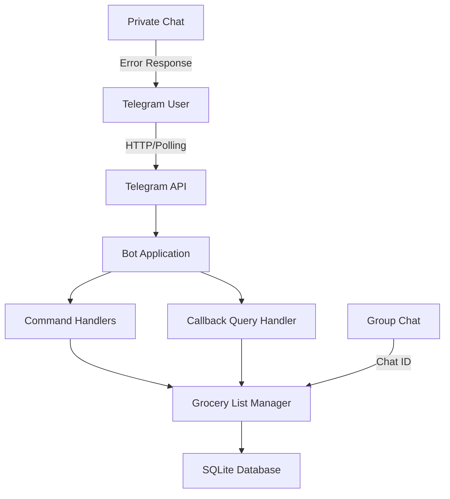

# GroceryBot - Telegram Group Grocery List Manager

## Project Overview
A Telegram bot that manages shared grocery lists in group chats. Each group has its own independent grocery list with completion tracking.

## Technology Stack
- **Language**: Python 3.10+
- **Library**: python-telegram-bot v20+
- **Database**: SQLite (built-in, no external dependencies)
- **Architecture**: Simple handler-based bot with callback queries

## Features
1. **Add Items** - Add grocery items with `/add <item>` or `/add item1, item2`
2. **Toggle Complete** - Mark items as done/undone using inline buttons from `/list`
3. **Remove Items** - Delete items using inline buttons from `/remove`
4. **View List** - See current list with toggle buttons via `/list`
5. **Clear List** - Clear all items with `/clear`
6. **Help** - Get help with `/help`

## System Architecture



## Database Schema

### grocery_items table
| Column | Type | Description |
|--------|------|-------------|
| id | INTEGER PRIMARY KEY | Auto-increment ID |
| chat_id | INTEGER | Telegram group chat ID |
| item | TEXT | Grocery item name (lowercase) |
| completed | INTEGER | 0 = not done, 1 = done |
| added_at | TIMESTAMP | When item was added |

## Command Handlers

| Command | Description | Example |
|---------|-------------|---------|
| `/add` | Add item(s) to list | `/add milk, eggs` |
| `/list` | Show list with toggle buttons | `/list` |
| `/remove` | Show list with remove buttons | `/remove` |
| `/clear` | Clear all items from list | `/clear` |
| `/help` | Show help message | `/help` |

## Project Structure
```
grocerybot/
├── bot.py              # Main bot application
├── config.py           # Configuration management
├── database.py         # Database operations
├── handlers/           # Command handlers
│   ├── __init__.py
│   ├── add.py         # /add command
│   ├── remove.py      # /remove command (shows remove buttons)
│   ├── list.py        # /list command (shows toggle buttons)
│   ├── clear.py       # /clear command
│   ├── help.py        # /help command
│   ├── callbacks.py   # Callback query handler for inline buttons
│   └── utils.py       # Shared utility functions
├── requirements.txt    # Python dependencies
├── README.md          # Setup instructions
├── .env.example       # Environment variables template
└── .gitignore        # Git ignore rules
```

## Configuration
- Bot Token: From @BotFather on Telegram
- Database: grocerybot.db (SQLite)
- Logging: Console output with timestamps

## Deployment Notes
- Bot can run on any Python 3.10+ environment
- Uses polling by default (simpler setup)
- Can switch to webhook mode for production
- Each group chat gets isolated list storage by chat_id

## Inline Buttons
- `/list` shows toggle buttons: `[✅ item]` to mark done, `[↩️ item]` to undo
- `/remove` shows remove buttons: `[🗑️ item]` to delete
- Callbacks are handled by `handlers/callbacks.py`
