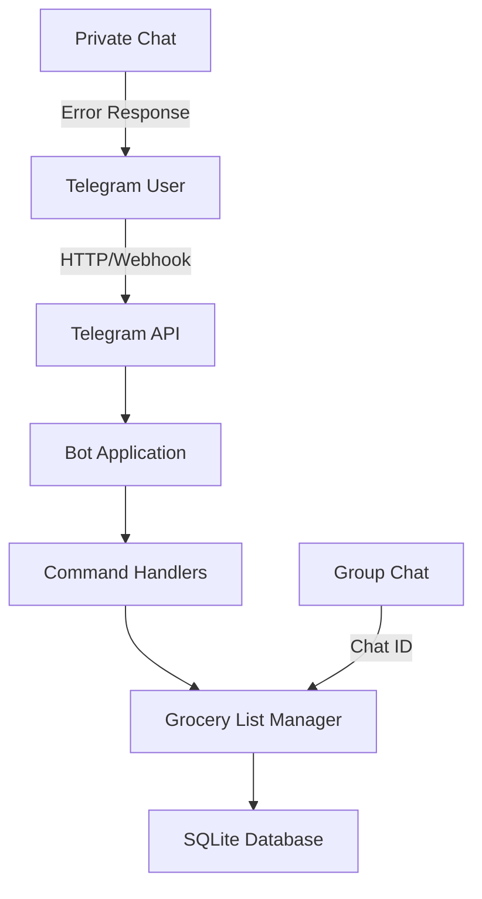

# GroceryBot - Telegram Group Grocery List Manager

## Project Overview
A Telegram bot that manages shared grocery lists in group chats. Each group has its own independent grocery list.

## Technology Stack
- **Language**: Python 3.10+
- **Library**: python-telegram-bot v20+
- **Database**: SQLite (built-in, no external dependencies)
- **Architecture**: Simple handler-based bot

## Features
1. **Add Items** - Add grocery items to the list with `/add <item>` or `/add item1, item2, item3`
2. **Remove Items** - Remove items with `/remove <item>` or by number `/remove 1`
3. **View List** - See current list with `/list` or `/list@botname`
4. **Clear List** - Clear all items with `/clear`
5. **Help** - Get help with `/help`

## System Architecture



## Database Schema

### grocery_lists table
| Column | Type | Description |
|--------|------|-------------|
| id | INTEGER PRIMARY KEY | Auto-increment ID |
| chat_id | INTEGER | Telegram group chat ID |
| item | TEXT | Grocery item name |
| added_at | TIMESTAMP | When item was added |

## Command Handlers

| Command | Description | Example |
|---------|-------------|---------|
| /add | Add item(s) to list | /add milk, eggs |
| /remove | Remove item by name or number | /remove milk or /remove 1 |
| /list | Show current grocery list | /list |
| /clear | Clear all items from list | /clear |
| /help | Show help message | /help |

## Project Structure
```
grocerybot/
├── bot.py              # Main bot application
├── config.py           # Configuration management
├── database.py         # Database operations
├── handlers/           # Command handlers
│   ├── __init__.py
│   ├── add.py
│   ├── remove.py
│   ├── list.py
│   ├── clear.py
│   └── help.py
├── models/
│   └── __init__.py
├── requirements.txt    # Python dependencies
├── README.md          # Setup instructions
└── .env.example       # Environment variables template
```

## Configuration
- Bot Token: From @BotFather on Telegram
- Database: grocerybot.db (SQLite)
- Logging: Console output with timestamps

## Deployment Notes
- Bot can run on any Python 3.10+ environment
- Uses polling by default (simpler setup)
- Can switch to webhook mode for production
- Each group chat gets isolated list storage by chat_id
